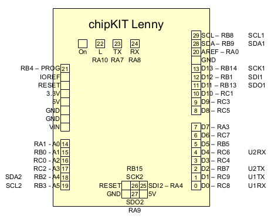

ChipKIT Lenny ([manual](https://majenko.co.uk/sites/default/files/products/DS1184.pdf))
is an Arduino compatible board, based on
[Microchip PIC32MX270](http://www.microchip.com/wwwproducts/en/PIC32MX270F256D)
microcontroller.

Features:
  * PIC32MX270F256D microcontroller 40 MHz (MIPS architecture)
  * 23 i/o pins
  * Compatible with Arduino shields
  * One power LED and three user LEDs
  * User button
  * Reset button
  * External oscillator 8 MHz
  * MicroUSB connector
  * External power connector

Memory:
  * 64 kbytes of RAM
  * 256 kbytes of Flash memory
  * 12 kbytes of additional boot Flash memory

Digital outputs can sink or source up to 18 mA.
A rich set of peripheral functions is available: UART, SPI, I2C, ADC, PWM, timers.
Power can be sourced from miniUSB, or from external power supply +6.5 ... 12 VDC.

# Signals #

### Digital connector ###
| **Signal**| **PIC32**  |
|:----------|:-----------|
|   SCL     | RB8 - SCL1 |
|   SDA     | RB9 - SDA1 |
|   AREF    | RA0        |
|   GND     |  --        |
|   13      | RB14 - SCK1|
|   12      | RB1 - SDI1 |
|   11      | RB13 - SDO1|
|   10      | RC1        |
|   9       | RC3        |
|   8       | RC5        |
|   7       | RA3        |
|   6       | RC7        |
|   5       | RB5        |
|   4       | RC6 - U2RX |
|   3       | RC4        |
|   2       | RB7 - U2TX |
|   1       | RC9 - U1TX |
|   0       | RC8 - U1RX |

### Analog connector ###
| **Signal**| **PIC32**  |
|:----------|:-----------|
|  A0       | RA1        |
|  A1       | RB0        |
|  A2       | RC0        |
|  A3       | RC2        |
|  A4       | RB2 - SDA2 |
|  A5       | RB3 - SCL2 |

### Power connector ###
| **Signal**| **Function**              |
|:----------|:--------------------------|
|  PROG     | RB4                       |
|  IOREF    | 3.3V Logic Voltage        |
|  RESET    | MCLR                      |
|  3.3V     | 3.3V Core Supply Voltage  |
|  5V       | 5V Supply Voltage         |
|  GND      | Common Ground             |
|  GND      | Common Ground             |
|  VIN      | Input power (6.5V - 12V)  |

### SPI connector ###
| RESET | RB15 - SCK2 | RA4 - SDI2 |
| GND   | RA9 - SDO2  | 5V         |

### LEDs ###
| **LED** | **PIC32** |
|:--------|:----------|
|  L      | RA10      |
|  TX     | RA7       |
|  RX     | RA8       |
